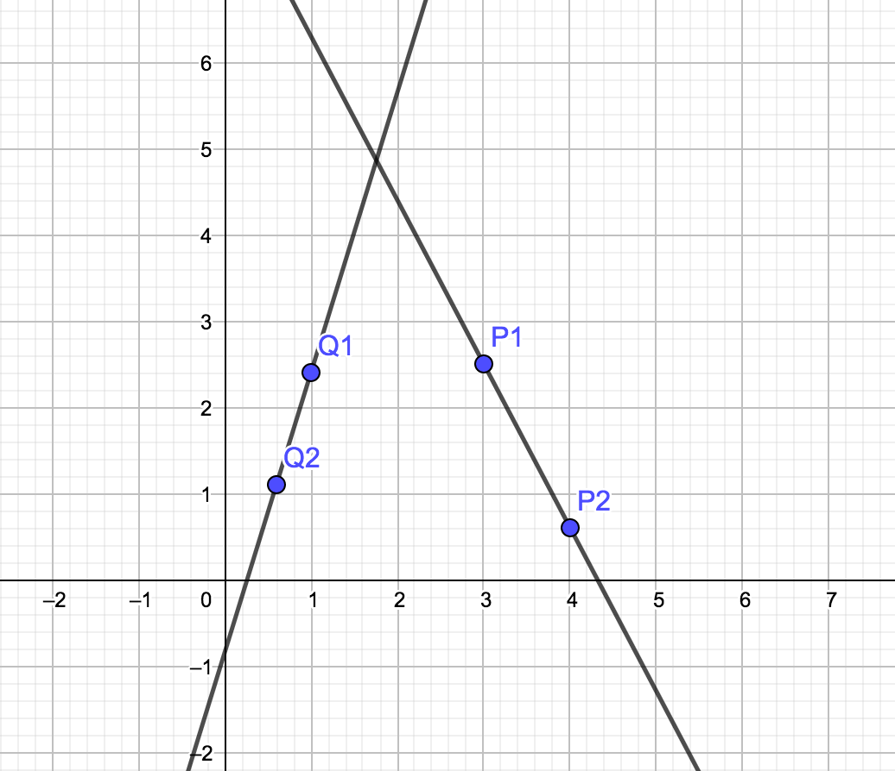

# Robótica Computacional

## Avaliação Nabla da P1

Observações de avaliações nesta disciplina:
* Esta prova tem 10 pontos, mas seu efeito é de substituir a P1 anterior com no máximo conceito $5.0$

Orientações gerais:
* Voce tem dois robôs disponíveis. Conte com apenas 20 minutos efetivos de funcionamento ou 30-40 minutos de *standby* para cada robô. Não deixe seu robô ligado sem necessidade
* Todas as questões de ROS podem ser feitas com robô real ou simulado
* As questões de OpenCV podem ser feitas em qualquer sistema operacional, desde que tenham OpenCV 3.4.4
* Você pode consultar a *Internet* livremente, mas não pode se comunicar com outras pessoas da turma ou de fora dela sobre o conteúdo da prova. Tentativas de comunicação serão severamente punidas.
* Rode o script `apaga_para_entrega.sh` antes de enviar
* Ao final da prova, compacte a pasta com todo o seu código e envie pelo Blackboard.
* A responsabilidade por ter o *setup* funcionando é de cada estudante
* Haverá [uma planilha](https://docs.google.com/spreadsheets/d/1RTOS66NtEd8PdhTv0O-wmm3N3WhBQXyQx0hY8pWvgog/edit?usp=sharing)  compartilhada com fila para dúvidas. Indique nela se seu problema é de **infra** ou **geral**

Existe algumas dicas de referência rápida de setup [instrucoes_setup.md](instrucoes_setup.md)

# Questões

## Questão 1

Robôs que trabalham dentro de prédios precisam saber seguir corredores.

Uma das maneiras de fazer isso é o robô alinhar o centro de sua câmera ao ponto de fuga do corredor, para que sua trajetória seja aproximadamente paralela às paredes do mesmo.

O ponto de fuga é aquele para o qual as retas paralelas parecem convergir

Dada a seguinte imagem de um corredor:

Podemos traçar as linhas geradas pela perspectiva, seu ponto de encontro será o ponto de fuga:

### Revisão: reta passando por dois pontos

**Nota: Melhor acompanhar esta parte matemática na [versãoo PDF](enunciado.pdf)** 

Seja o ponto $A:(a_x, a_y)$ e o ponto $B:(b_x, b_y)$

Queremos encontrar uma reta $r: y = mx + h$ que passa por $A$ e $B$, em que $m$ é o *coeficiente angular* e $h$ é o intercepto ou coeficiente linear da reta.

Temos que:

$m = \frac{\Delta_y}{\Delta_x} = \frac{b_y - a_y}{b_x - a_x}$

Uma vez encontrado o valor de $m$, a substituição a seguir permite encontrar a equação da reta:

$m = \frac{y - a_y}{x - a_x}$

$mx - ma_x = y - a_y$

$mx = y - a_y + ma_x$

$y = mx -ma_x + a_y$

$h = a_y - ma_x$

$y = mx - ma_x + a_y$

### Interseção de duas retas

Temos que na interseção as duas retas se encontram num ponto $(x_i, y_i)$

Sejam as retas $r1: y = m1x + h1$ e $r2: y = m2x + h2$

Vamos encontrar o ponto $x_i$ em que os valores de $y_i$ serão iguais:

$m1x_i + h1 = m2x_i + h2$

$(m1 - m2)x_i = h2 - h1$

$x_i = \frac{h2 - h1}{m1 - m2}$

$y_i = m1x_i + h1$

Pede-se: A partir do ponto para onde convergem as linhas do corredor, marque o ponto de fuga. Você precisa mostrar as retas que vão convergir.

**Sugestão:** 

A partir do coeficiente angular, selecionar uma reta mais à esquerda e uma mais à direita para encontrar a interseção.

Lembre-se de que na OpenCV o eixo y fica **para baixo**, por isso os coeficientes angulares se comportam como na figura abaixo:

<

Lembre-se de que, no espaço de cores HSV, o vermelho se encontra no início e no fim da escala do componente H. Se você estiver filtrando vermelho em um só dos extremos pode não ter bons resultados

Dicas:
* Lembre-se da aula 2
* Só precisa funcionar **para esta vídeo em particular**, não para quaisquer toranjas
* Não é uma questão de ROS. Trabalhe na pasta `p1_webcam`
* Você pode usar Python 2 ou Python 3 conforme preferir

|Resultado| Conceito| 
|---|---|
| Não executa | 0 |
| Seleciona laranjas corretamente e obtém máscara | 1.0 |
| Conta laranjas | 1.5 |
| Desenha círculo só sobre as maduras | 2.5 | 

Casos intermediários ou omissos da rubrica serão decididos pelo professor.

## Questão 2

Você vai receber uma caixa avermelhada.

Faca um programa que imprime na imagem a distância entre a caixa vermelha e sua webcam.

Você pode assumir que a caixa é mantida sempre na vertical

Assuma que a resolućão da webcam é `640 x 480`  e que a imagem abaixo foi obtida com a caixa a uma distância de 100cm da webcam.

|Resultado| Conceito| 
|---|---|
| Não executa | 0 |
| Calcula a distância focal | 0.5 |
| Segmenta a caixa mostrando contoro e calculando altura | 1.5 |
| Imprime distância interativamente  na webcam | 2.5 | 

Casos intermediários ou omissos da rubrica serão decididos pelo professor.

## Questão 3 - ROS

Faça um programa em ROS que realize as seguintes tarefas:

* Sorteia um ângulo $\alpha$

* Gira o robô uma magnitude $\alpha$ no sentido horário

* Faz o robô comećar a andar em frente (em suas coordenadas locais)

* Usa a odometria (tópico `\odom`) para deixar o robô imóvel depois que este andou $1.33m$ em relaćão a sua posićào inicial

|Resultado| Conceito| 
|---|---|
| Não executa | 0 |
| Gira alpha no sentido certo | 1.0 |
|  Recebe odometria | 1.5 |
| Para após andar | 2.5 | 

# Questão 4 - ROS + cv

**Atenćão: você vai usar OpenCV mas não vai trabalhar com imagens de câmera**

Você deve trabalhar no arquivo `le_scan_grafico.py`

O que você deve fazer:
* Leia os dados do *lidar* 
* Represente o robô na coordenada 256,256 da imagem usando um círculo
* Adotando a escala $1 pixel = 2 cm$ desenhe todas as leituras válidas do lidar na imagem
* Traça as retas encontradas usando a transformada de Hough Lines

|Resultado| Conceito| 
|---|---|
| Não executa | 0 |
| Desenha os pontos corretamente | 1.5 |
|  Traça a reta | 2.5 | 
