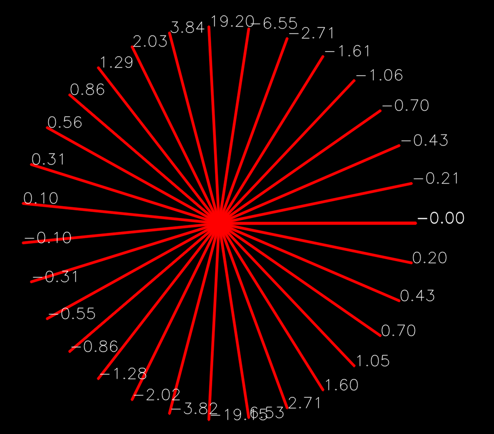

# Robótica Computacional

## Avaliação Nabla da P1

Observações de avaliações nesta disciplina:

* Esta prova tem 10 pontos, mas seu efeito é de substituir a P1 anterior com no máximo conceito $5.0$

Orientações gerais:

* Você tem dois robôs disponíveis. Conte com apenas 20 minutos efetivos de funcionamento ou 30-40 minutos de *standby* para cada robô. Não deixe seu robô ligado sem necessidade
* Todas as questões de ROS podem ser feitas com robô real ou simulado
* As questões de OpenCV podem ser feitas em qualquer sistema operacional, desde que tenham OpenCV 3.4.4
* Você pode consultar a *Internet* livremente, mas não pode se comunicar com outras pessoas da turma ou de fora dela sobre o conteúdo da prova. Tentativas de comunicação serão severamente punidas.
* Rode o script `apaga_para_entrega.sh` antes de enviar
* Ao final da prova, compacte a pasta com todo o seu código e envie pelo Blackboard.
* A responsabilidade por ter o *setup* funcionando é de cada estudante
* Haverá [uma planilha](https://docs.google.com/spreadsheets/d/1RTOS66NtEd8PdhTv0O-wmm3N3WhBQXyQx0hY8pWvgog/edit?usp=sharing)  compartilhada com fila para dúvidas. Indique nela se seu problema é de **infra** ou **geral**

Existe algumas dicas de referência rápida de setup [instrucoes_setup.md](instrucoes_setup.md)


# Questões


## Questão 1 - OpenCV e Visão

Robôs que trabalham dentro de prédios precisam saber seguir corredores.

Uma das maneiras de fazer isso é o robô alinhar o centro de sua câmera ao ponto de fuga do corredor, para que sua trajetória seja aproximadamente paralela às paredes do mesmo.


O ponto de fuga é aquele para o qual as retas paralelas parecem convergir

Dada a seguinte imagem de um corredor:


Podemos traçar as linhas geradas pela perspectiva, seu ponto de encontro será o ponto de fuga:


### Revisão: reta passando por dois pontos


**Nota: Melhor acompanhar esta parte matemática na [versão PDF](enunciado.pdf)** 

Seja o ponto $A:(a_x, a_y)$ e o ponto $B:(b_x, b_y)$

Queremos encontrar uma reta $r: y = mx + h$ que passa por $A$ e $B$, em que $m$ é o *coeficiente angular* e $h$ é o intercepto ou coeficiente linear da reta.

Temos que:

$m = \frac{\Delta_y}{\Delta_x} = \frac{b_y - a_y}{b_x - a_x}$

Uma vez encontrado o valor de $m$, a substituição a seguir permite encontrar a equação da reta:

$m = \frac{y - a_y}{x - a_x}$

$mx - ma_x = y - a_y$

$mx = y - a_y + ma_x$

$y = mx -ma_x + a_y$

$h = a_y - ma_x$


$y = mx - ma_x + a_y$

### Interseção de duas retas

Temos que na interseção as duas retas se encontram num ponto $(x_i, y_i)$

Sejam as retas $r1: y = m1x + h1$ e $r2: y = m2x + h2$

Vamos encontrar o ponto $x_i$ em que os valores de $y_i$ serão iguais:

$m1x_i + h1 = m2x_i + h2$

$(m1 - m2)x_i = h2 - h1$

$x_i = \frac{h2 - h1}{m1 - m2}$

$y_i = m1x_i + h1$

**Dados de teste:**

As retas definidas por pontos $r1: (P_1, P_2)$ e $r2: (Q_1, Q_2)$, para os valores:

```python

p1 = (3.0, 2.5)
p2 = (4.0, 0.6)
q1 = (1.0, 2.4)
q2 = (0.6, 1.1)
```

Encontram-se no ponto `(1.7572 4.8611)`


Pede-se: 
* A partir do ponto para onde convergem as linhas do corredor, marque o ponto de fuga no vídeo `hall.mp4`. Você precisa mostrar as retas que vão convergir.


**Sugestão:** 

A partir do coeficiente angular, selecionar uma reta mais à esquerda e uma mais à direita para encontrar a interseção.

Lembre-se de que na OpenCV o eixo y fica **para baixo**, por isso os coeficientes angulares se comportam como na figura abaixo:



Lembre-se de que, no espaço de cores HSV, o vermelho se encontra no início e no fim da escala do componente H. Se você estiver filtrando vermelho em um só dos extremos pode não ter bons resultados


Dicas:

* Lembre-se da aula 2
* Só precisa funcionar **para este vídeo em particular**, não para qualquer corredor
* Não é uma questão de ROS. Trabalhe na pasta `q1_opencv`
* Você pode usar Python 2 ou Python 3 conforme preferir


|Resultado| Conceito| 
|:---------------------------------------|:------:|
| Não executa | 0 |
| Encontra máscara que seleciona uma região de interesse (chão, paredes ou teto)  corretamente e mostra a imagem| 1.0 |
| Encontra as retas corretamente via transformada de Hough | 2.0|
| Implementa uma função que dadas as retas definidas por pontos $r1: (P1, P2)$ e $r2: (Q1, Q2)$ encontra o ponto de interseção | 3.0 |
| Usa a função do item anterior para achar *alguma* interseção baseado nas retas obtidas via *Hough* | 4.0 | 
| Plota o ponto de fuga corretamente na tela | 5.0 |

Casos intermediários ou omissos da rubrica serão decididos pelo professor.


## Questão 2 - ROS

Vamos trabalhar com o tópico `/imu` , que traz os dados da unidade inercial do robô.

Existe um exemplo em que você pode se basear [neste link https://github.com/Insper/robot19/blob/master/ros/exemplos_python/scripts/le_imu.py](https://github.com/Insper/robot19/blob/master/ros/exemplos_python/scripts/le_imu.py).


O que você deve fazer: Um programa que detecta que o robô está sendo inclinado para a frente ou para trás, imprime uma mensagem para alertar e move as rodas para tentar desfazer a inclinação.

**Você deve se basear na medida de giroscópio - ângulos de orientação**.  Não use a gravidade. 

No simulador, para inclinar o robô use a ferramenta de rotação da barra de ferramentas


|Resultado| Conceito| 
|:---------------------------------------|:------:|
| Não executa | 0 |
| Identifica a inclinação e imprime mensagem | 1.25 |
| Quando inclinado, realiza movimento no sentido a cancelar a inclinação| 2.5 |


Casos intermediários ou omissos da rubrica serão decididos pelo professor.


## Questão 3 - ROS

Faça um programa em ROS que realize as seguintes tarefas:

* Continuamente monitora o tópico de odometria `/odom`
* Marca numa imagem a trajetória que o robô segue

**Atenção:** Seu programa roda em paralelo com o *teleop*, e não deve controlar a posição do robô por si só

Trabalhe sobre o arquivo `breadcrumbs.py`

Depois de andar um pouco com o robô seu resultado deve ficar parecido com o da figura abaixo:


|Resultado| Conceito| 
|:---------------------------------------|:------:|
| Não executa | 0 |
| Consegue extrair corretamente os dados do tópico de odometria, imprimindo-os | 1.25 |
| Apresenta o mapa numa imagem quando o robô é pilotado via *teleop* | 2.5 | 


**Boa sorte!**

**Não saia sem mostrar o resultado ao professor**
